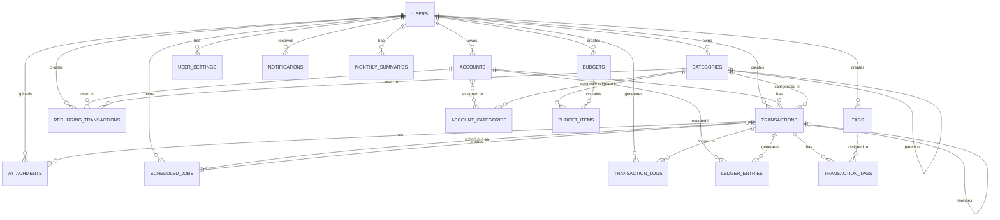

# Myer Database Schema - Complete Documentation

**Version:** 1.0  
**Last Updated:** 2024-12-01  
**Database:** MySQL (InnoDB)

---

## 1. Entity Relationship Diagram (ERD)

---

## 2. Table Definitions

### 2.1 Core Tables

#### `users`
| Field | Type | Constraints |
|-------|------|-------------|
| id | BIGINT | PK, AUTO_INCREMENT |
| name | VARCHAR(255) | NOT NULL |
| email | VARCHAR(255) | UNIQUE, NOT NULL |
| email_verified_at | TIMESTAMP | NULLABLE |
| password | VARCHAR(255) | NOT NULL |
| remember_token | VARCHAR(100) | NULLABLE |
| created_at | TIMESTAMP | |
| updated_at | TIMESTAMP | |

#### `accounts`
| Field | Type | Constraints |
|-------|------|-------------|
| id | BIGINT | PK, AUTO_INCREMENT |
| uuid | CHAR(36) | UNIQUE, NOT NULL |
| user_id | BIGINT | FK → users.id, CASCADE |
| name | VARCHAR(100) | NOT NULL |
| type | ENUM | cash, bank, ewallet, investment, credit |
| initial_balance | DECIMAL(15,2) | DEFAULT 0 |
| currency | CHAR(3) | DEFAULT 'IDR' |
| last_reconciled_at | TIMESTAMP | NULLABLE |
| is_active | BOOLEAN | DEFAULT TRUE |
| deleted_at | TIMESTAMP | NULLABLE |
| created_at | TIMESTAMP | |
| updated_at | TIMESTAMP | |

**Indexes:** idx_accounts_user_type, idx_accounts_currency, idx_accounts_is_active

#### `categories`
| Field | Type | Constraints |
|-------|------|-------------|
| id | BIGINT | PK, AUTO_INCREMENT |
| user_id | BIGINT | FK → users.id, CASCADE |
| name | VARCHAR(100) | NOT NULL |
| type | ENUM | income, expense |
| parent_id | BIGINT | FK → categories.id, NULLABLE |
| icon | VARCHAR(50) | NULLABLE |
| color | CHAR(7) | NULLABLE |
| position | INT | DEFAULT 0 |
| is_active | BOOLEAN | DEFAULT TRUE |
| deleted_at | TIMESTAMP | NULLABLE |
| created_at | TIMESTAMP | |
| updated_at | TIMESTAMP | |

**Indexes:** uq_categories_user_name_type, idx_categories_user_type, idx_categories_position, idx_categories_is_active

#### `transactions`
| Field | Type | Constraints |
|-------|------|-------------|
| id | BIGINT | PK, AUTO_INCREMENT |
| user_id | BIGINT | FK → users.id, CASCADE |
| idempotency_key | CHAR(36) | UNIQUE, NULLABLE |
| client_request_id | VARCHAR(255) | NULLABLE |
| account_id | BIGINT | FK → accounts.id, CASCADE |
| transfer_account_id | BIGINT | FK → accounts.id, NULLABLE |
| category_id | BIGINT | FK → categories.id, NULLABLE |
| type | ENUM | income, expense, transfer |
| amount | DECIMAL(15,2) | NOT NULL |
| transaction_date | DATE | NOT NULL |
| notes | TEXT | NULLABLE |
| status | ENUM | draft, posted, locked, voided |
| posting_date | TIMESTAMP | NULLABLE |
| version | INT UNSIGNED | DEFAULT 0 |
| reversal_of_id | BIGINT | FK → transactions.id, NULLABLE |
| is_reversal | BOOLEAN | DEFAULT FALSE |
| transaction_group_id | CHAR(36) | NOT NULL |
| cleared | BOOLEAN | DEFAULT FALSE |
| deleted_at | TIMESTAMP | NULLABLE |
| created_at | TIMESTAMP | |
| updated_at | TIMESTAMP | |

**Indexes:** idx_transactions_user_date, idx_transactions_user_status_date, idx_transactions_user_type_date, idx_transactions_client_request_id, idx_transactions_cleared, idx_transactions_group_id

#### `ledger_entries`
| Field | Type | Constraints |
|-------|------|-------------|
| id | BIGINT | PK, AUTO_INCREMENT |
| transaction_id | BIGINT | FK → transactions.id, CASCADE |
| account_id | BIGINT | FK → accounts.id |
| debit_amount | DECIMAL(15,2) | DEFAULT 0, CHECK >= 0 |
| credit_amount | DECIMAL(15,2) | DEFAULT 0, CHECK >= 0 |
| transaction_group_id | CHAR(36) | NOT NULL |
| sequence_no | SMALLINT | NOT NULL |
| created_at | TIMESTAMP | |
| updated_at | TIMESTAMP | |

**Indexes:** idx_ledger_entries_account_created, idx_ledger_entries_group_id

**CHECK Constraints:**
- chk_debit_or_credit_positive: (debit > 0 AND credit = 0) OR (debit = 0 AND credit > 0)
- chk_debit_non_negative: debit >= 0
- chk_credit_non_negative: credit >= 0

**Triggers:** trg_ledger_balance_check, trg_ledger_balance_update

---

### 2.2 Budgeting Tables

#### `budgets`
| Field | Type | Constraints |
|-------|------|-------------|
| id | BIGINT | PK |
| user_id | BIGINT | FK → users.id, CASCADE |
| year | SMALLINT | NOT NULL |
| month | TINYINT | NOT NULL |
| created_at | TIMESTAMP | |
| updated_at | TIMESTAMP | |

**Indexes:** uq_budgets_user_year_month, idx_budgets_user_year_month

#### `budget_items`
| Field | Type | Constraints |
|-------|------|-------------|
| id | BIGINT | PK |
| budget_id | BIGINT | FK → budgets.id, CASCADE |
| category_id | BIGINT | FK → categories.id, NULLABLE |
| planned_amount | DECIMAL(15,2) | DEFAULT 0 |
| actual_amount | DECIMAL(15,2) | DEFAULT 0 |
| last_synced_at | TIMESTAMP | NULLABLE |
| created_at | TIMESTAMP | |
| updated_at | TIMESTAMP | |

**Indexes:** uq_budget_items_budget_category

---

### 2.3 Automation Tables

#### `recurring_transactions`
| Field | Type | Constraints |
|-------|------|-------------|
| id | BIGINT | PK |
| user_id | BIGINT | FK → users.id, CASCADE |
| account_id | BIGINT | FK → accounts.id |
| category_id | BIGINT | FK → categories.id, NULLABLE |
| type | ENUM | income, expense |
| amount | DECIMAL(15,2) | NOT NULL |
| frequency | ENUM | daily, weekly, monthly, yearly |
| day_of_month | TINYINT | NULLABLE |
| next_run_date | DATE | NOT NULL |
| total_runs | INT UNSIGNED | NULLABLE |
| run_count | INT UNSIGNED | DEFAULT 0 |
| is_active | BOOLEAN | DEFAULT TRUE |
| last_executed_at | TIMESTAMP | NULLABLE |
| created_at | TIMESTAMP | |
| updated_at | TIMESTAMP | |

**Indexes:** uq_recurring_transactions_unique_active, idx_recurring_transactions_scheduler, idx_recurring_transactions_next_run

#### `scheduled_jobs`
| Field | Type | Constraints |
|-------|------|-------------|
| id | BIGINT | PK |
| recurring_transaction_id | BIGINT | FK → recurring_transactions.id, CASCADE |
| user_id | BIGINT | FK → users.id, CASCADE |
| transaction_id | BIGINT | FK → transactions.id, NULLABLE |
| scheduled_at | DATETIME | NOT NULL |
| status | ENUM | pending, processing, completed, failed, skipped |
| error_message | TEXT | NULLABLE |
| attempts | INT UNSIGNED | DEFAULT 0 |
| locked_at | TIMESTAMP | NULLABLE |
| created_at | TIMESTAMP | |
| updated_at | TIMESTAMP | |

**Indexes:** idx_scheduled_jobs_status_scheduled, idx_scheduled_jobs_user_status, idx_scheduled_jobs_scheduled

---

### 2.4 Audit & Logs

#### `transaction_logs`
| Field | Type | Constraints |
|-------|------|-------------|
| id | BIGINT | PK |
| transaction_id | BIGINT | FK → transactions.id, CASCADE |
| user_id | BIGINT | FK → users.id |
| action | ENUM | created, updated, deleted |
| old_data | JSON | NULLABLE |
| new_data | JSON | NULLABLE |
| ip_address | VARCHAR(45) | NULLABLE |
| user_agent | TEXT | NULLABLE |
| checksum | CHAR(64) | NULLABLE |
| created_at | TIMESTAMP | |
| updated_at | TIMESTAMP | |

**Indexes:** idx_transaction_logs_transaction_created, idx_transaction_logs_user_created

---

### 2.5 Metadata Tables

#### `tags`
| Field | Type | Constraints |
|-------|------|-------------|
| id | BIGINT | PK |
| user_id | BIGINT | FK → users.id, CASCADE |
| name | VARCHAR(50) | NOT NULL |
| color | CHAR(7) | NULLABLE |
| created_at | TIMESTAMP | |
| updated_at | TIMESTAMP | |

**Indexes:** uq_tags_user_name, idx_tags_user_name

#### `monthly_summaries`
| Field | Type | Constraints |
|-------|------|-------------|
| id | BIGINT | PK |
| user_id | BIGINT | FK → users.id, CASCADE |
| year | SMALLINT | NOT NULL |
| month | TINYINT | NOT NULL |
| total_income | DECIMAL(15,2) | DEFAULT 0 |
| total_expense | DECIMAL(15,2) | DEFAULT 0 |
| net_savings | DECIMAL(15,2) | DEFAULT 0 |
| last_updated_at | TIMESTAMP | NULLABLE |
| created_at | TIMESTAMP | |
| updated_at | TIMESTAMP | |

**Indexes:** uq_monthly_summaries_user_year_month, idx_monthly_summaries_user_year_month

---

### 2.6 Pivot Tables

#### `transaction_tags`
| Field | Type | Constraints |
|-------|------|-------------|
| id | BIGINT | PK |
| transaction_id | BIGINT | FK → transactions.id, CASCADE |
| tag_id | BIGINT | FK → tags.id, CASCADE |
| created_at | TIMESTAMP | |
| updated_at | TIMESTAMP | |

**Indexes:** uq_transaction_tags_transaction_tag, idx_transaction_tags_tag_id

#### `account_categories`
| Field | Type | Constraints |
|-------|------|-------------|
| id | BIGINT | PK |
| account_id | BIGINT | FK → accounts.id, CASCADE |
| category_id | BIGINT | FK → categories.id, CASCADE |
| created_at | TIMESTAMP | |
| updated_at | TIMESTAMP | |

**Indexes:** uq_account_categories_account_category

---

### 2.7 User Features

#### `user_settings`
| Field | Type | Constraints |
|-------|------|-------------|
| id | BIGINT | PK |
| user_id | BIGINT | FK → users.id, CASCADE |
| key | VARCHAR(100) | NOT NULL |
| value | TEXT | NULLABLE |
| type | VARCHAR(50) | DEFAULT 'string' |
| created_at | TIMESTAMP | |
| updated_at | TIMESTAMP | |

**Indexes:** uq_user_settings_user_key, idx_user_settings_user_key

#### `notifications`
| Field | Type | Constraints |
|-------|------|-------------|
| id | BIGINT | PK |
| user_id | BIGINT | FK → users.id, CASCADE |
| type | VARCHAR(100) | NOT NULL |
| title | VARCHAR(255) | NOT NULL |
| message | TEXT | NULLABLE |
| data | JSON | NULLABLE |
| channel | VARCHAR(50) | DEFAULT 'database' |
| priority | ENUM | low, medium, high |
| read_at | TIMESTAMP | NULLABLE |
| scheduled_at | TIMESTAMP | NULLABLE |
| sent_at | TIMESTAMP | NULLABLE |
| created_at | TIMESTAMP | |
| updated_at | TIMESTAMP | |

**Indexes:** idx_notifications_user_read, idx_notifications_user_created, idx_notifications_scheduled

#### `attachments`
| Field | Type | Constraints |
|-------|------|-------------|
| id | BIGINT | PK |
| transaction_id | BIGINT | FK → transactions.id, CASCADE |
| user_id | BIGINT | FK → users.id, CASCADE |
| filename | VARCHAR(255) | NOT NULL |
| original_filename | VARCHAR(255) | NOT NULL |
| mime_type | VARCHAR(100) | NOT NULL |
| file_size | BIGINT | NOT NULL |
| path | VARCHAR(500) | NOT NULL |
| disk | VARCHAR(50) | DEFAULT 'local' |
| checksum | CHAR(64) | NULLABLE |
| description | TEXT | NULLABLE |
| created_at | TIMESTAMP | |
| updated_at | TIMESTAMP | |

**Indexes:** idx_attachments_transaction_created, idx_attachments_user_created, idx_attachments_checksum

---

### 2.8 Utility Tables

#### `currency_rates`
| Field | Type | Constraints |
|-------|------|-------------|
| id | BIGINT | PK |
| base_currency | CHAR(3) | NOT NULL |
| target_currency | CHAR(3) | NOT NULL |
| rate | DECIMAL(20,8) | NOT NULL |
| effective_date | DATE | NOT NULL |
| created_at | TIMESTAMP | |
| updated_at | TIMESTAMP | |

**Indexes:** uq_currency_rates_currency_date, idx_currency_rates_currencies, idx_currency_rates_date

#### `sessions`
| Field | Type | Constraints |
|-------|------|-------------|
| id | VARCHAR(255) | PK |
| user_id | BIGINT | FK → users.id, NULLABLE |
| ip_address | VARCHAR(45) | NULLABLE |
| user_agent | TEXT | NULLABLE |
| payload | TEXT | NOT NULL |
| last_activity | INT | NOT NULL |

---

## 3. Constraints Summary

### Foreign Keys: 32 total
### Unique Constraints: 11 total  
### Check Constraints: 3 (ledger_entries)
### Triggers: 2 (ledger balance validation)

---

## 4. Production Safeguards

| Edge Case | Protection |
|-----------|-----------|
| Duplicate transactions | idempotency_key UNIQUE |
| Network retry | client_request_id indexed |
| Unbalanced ledger | CHECK + triggers |
| Race conditions | lockForUpdate() + version |
| Audit gaps | transaction_logs with checksum |

---

## 5. Migration Files (21 total)

| # | File |
|---|------|
| 1-3 | Laravel defaults (users, cache, jobs) |
| 4 | accounts |
| 5 | categories |
| 6 | transactions |
| 7 | ledger_entries (+ CHECK) |
| 8 | budgets |
| 9 | budget_items |
| 10 | transaction_logs |
| 11 | recurring_transactions |
| 12 | monthly_summaries |
| 13 | tags |
| 14 | ledger_triggers |
| 15 | transaction_tags |
| 16 | account_categories |
| 17 | user_settings |
| 18 | notifications |
| 19 | attachments |
| 20 | scheduled_jobs |
| 21 | currency_rates |

---

**End of Documentation**
